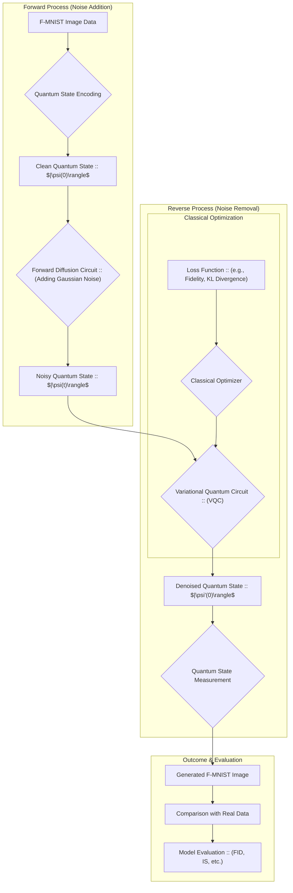

# Model Workflow

```mermaid
graph TD
    subgraph "Forward Process (Noise Addition)"
        A["F-MNIST Image Data"] --> B{"Quantum State Encoding"};
        B --> C["Clean Quantum State :: $|\psi(0)\rangle$"];
        C --> D{"Forward Diffusion Circuit :: (Adding Gaussian Noise)"};
        D --> E["Noisy Quantum State :: $|\psi(t)\rangle$"];
    end

    subgraph "Reverse Process (Noise Removal)"
        E --> F{"Variational Quantum Circuit :: (VQC)"};
        subgraph "Classical Optimization"
            H["Loss Function :: (e.g., Fidelity, KL Divergence)"] --> I{"Classical Optimizer"};
            I --> F;
        end
        F --> G["Denoised Quantum State :: $|\psi'(0)\rangle$"];
        G --> J{"Quantum State Measurement"};
    end

    subgraph "Outcome & Evaluation"
        J --> K["Generated F-MNIST Image"];
        K --> L["Comparison with Real Data"];
        L --> M["Model Evaluation :: (FID, IS, etc.)"];
    end
```
